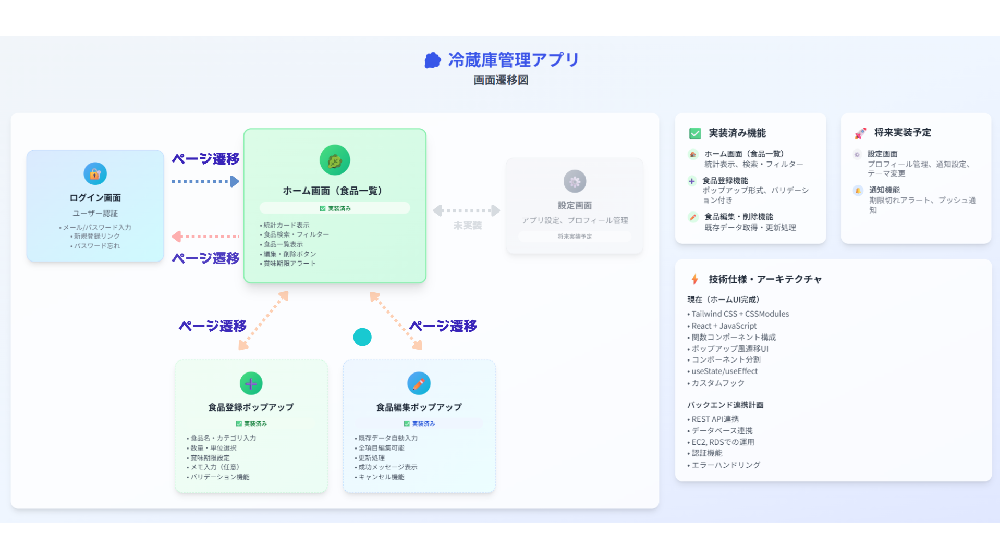

# 冷蔵庫管理アプリ - 仕様書

## 1. 概要

このアプリケーションは、家庭の冷蔵庫内の食品を効率的に管理する Web アプリケーションです。
React を使用したフロントエンドの構築と、Spring Boot を使用した API 開発、AWS でのクラウド運用の学習を目的に作成しました。
学習目的ということもあり、堅牢で信頼性の高いアプリケーションではありませんが、拝見いただけると幸いです。

- **アプリケーション情報**

ユーザー認証機能を備え、ログインしたユーザーごとに食品の登録、一覧表示、編集、削除（CRUD）が可能です。
ユーザー認証は既存ユーザーデータのみとなっており、
ユーザーの追加やパスワードのリセットは UI のみで動作し、データベース管理にはなっておりません。

※詳細情報は各階層にドキュメント化しておりますので、docsフォルダ内README.mdをご参照ください。

◆ 公開 URL: https://refrigerator-app.com

アプリケーション全体の公開は、OSをLinux(Ubuntu)に変更したPCから公開しております。


◆ スクリーンショット

### ログイン画面


### ホーム画面


### 画面遷移図



## 2. 主な機能

- **ユーザー認証**
  - 新規アカウント作成機能(UI のみ)
  - ログイン・ログアウト機能
    ※ログイン画面に表示される青枠のアカウント情報のいずれかの組み合わせを入力して頂くと、ホーム画面に遷移します
  - パスワードリセット機能（UI のみ）
- **食品管理 (CRUD)**
  - 食品の登録（品名、カテゴリ、数量、賞味期限など）
  - 登録済み食品の一覧表示
  - 食品情報の編集
  - 食品の削除（確認ダイアログ付き）
- **検索・フィルタリング**
  - 食品名によるリアルタイム検索
  - カテゴリによる絞り込み
- **統計表示**
  - 総食品数
  - 賞味期限が近い食品数
  - 期限切れの食品数

## 3. 技術スタック

### フロントエンド

- **フレームワーク**: React 19
- **ビルドツール**: Vite
- **スタイリング**: Tailwind CSS(component: 記述の少ない部分は一部 pages にも使用),
  CSS Modules(pages)
- **ルーティング**: React Router
- **言語**: JavaScript (JSX)

### バックエンド

- **フレームワーク**: Spring Boot 3.x
- **言語**: Java 17
- **データベース**: MySQL 8.0
- **データアクセス**: Spring Data JPA / Hibernate
- **ビルドツール**: Maven
- **その他**: Lombok, Spring Boot Validation

## 4. セットアップと実行方法

本アプリケーションはフロントエンドとバックエンドの2つのサーバーを起動する必要があります。それぞれ別のターミナルで実行してください。

### 1. バックエンドサーバーの起動
- **前提条件**:
JDK 17
Maven 3.8 以降
MySQL 8.0
- **手順**:
データベースのセットアップ:
MySQLでアプリケーション用のデータベース（例: refrigerator_db）を作成します。
backend/src/main/resources/application.properties を開き、ご自身の環境に合わせてデータベース接続情報を更新してください。
code
```Properties
spring.datasource.url=jdbc:mysql://localhost:3306/refrigerator_db?useSSL=false&serverTimezone=Asia/Tokyo
spring.datasource.username=your_mysql_user
spring.datasource.password=your_mysql_password
```

ビルドと起動:
リポジトリのルートディレクトリから、以下のコマンドを実行します。
code
```bash
# バックエンドのディレクトリに移動
cd backend
# Mavenでビルドとサーバーを起動
./mvnw spring-boot:run
```
サーバーが起動し、http://localhost:8080 でAPIが利用可能になります。

### 2. フロントエンドサーバーの起動
- **前提条件**:
Node.js
Yarn
手順:
依存関係のインストール:
リポジトリのルートディレクトリから、以下のコマンドを実行します。
code
```Bash
# フロントエンドのディレクトリに移動
cd front
# 依存関係をインストール
yarn install
```

開発サーバーの起動:
code
```bash
yarn dev
```
サーバーが起動し、http://localhost:5173 などでアプリケーションにアクセスできます。

## 5. ディレクトリ構造
```
  RefrigeratorManagement/
  ├── .git/                   # Gitリポジトリ関連
  ├── .vscode/                # VS Code設定
  ├── backend/                # バックエンド (Spring Boot) プロジェクト
  │   ├── .mvn/               # Maven Wrapper関連
  │   ├── src/                # Javaソースコード、リソース
  │   │   ├── main/
  │   │   │   ├── java/       # Javaソースコード
  │   │   │   └── resources/  # 設定ファイルなど
  │   │   └── test/           # テストコード
  │   ├── docs/               # バックエンドのドキュメント
  │   ├── mvnw                # Maven Wrapper (Linux/macOS)
  │   ├── mvnw.cmd            # Maven Wrapper (Windows)
  │   └── pom.xml             # Maven設定ファイル
  ├── front/                  # フロントエンド (React/Vite) プロジェクト
  │   ├── public/             # 静的ファイル
  │   ├── src/                # Reactコンポーネント、ページ、API連携など
  │   │   ├── api/            # API連携関連
  │   │   ├── component/      # 再利用可能なUIコンポーネント
  │   │   ├── context/        # React Context
  │   │   ├── data/           # モックデータ
  │   │   └── pages/          # 各ページに対応するコンポーネント
  │   ├── docs/               # フロントエンドのドキュメント
  │   ├── package.json        # npm/yarn設定ファイル
  │   ├── tailwind.config.js  # Tailwind CSS設定ファイル
  │   ├── vite.config.js      # Vite設定ファイル
  │   └── yarn.lock           # yarnロックファイル
  ├── docker-compose.yml      # Docker Compose設定ファイル
  ├── api_spec.md             # API仕様書
  ├── package.json            # ルートのnpm/yarn設定ファイル (ワークスペース用)
  ├── yarn.lock               # ルートのyarnロックファイル
  └── ...
  ```
